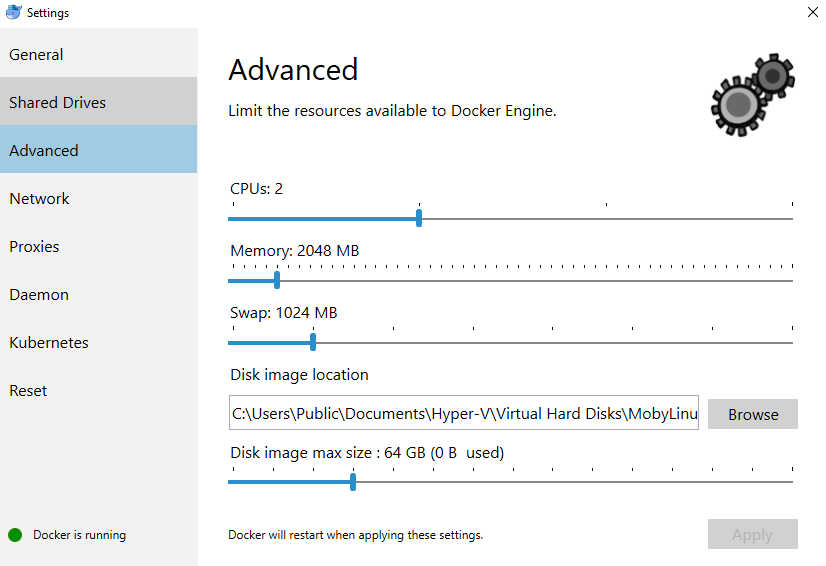

```{r setup, include=FALSE}
knitr::opts_chunk$set(echo = FALSE, message = FALSE, warning = FALSE)
```

```{r}
library(tidyverse)
library(knitr)
library(kableExtra)
```

# Introduction

This is an example of the workflow a PEPR study site might use to add geomarkers to their data with [DeGAUSS](https://github.com/cole-brokamp/DeGAUSS). 

In steps 2 through 5: 

+ A DeGAUSS container is used to add geomarker(s) to the input file (columns added in each step are highlighted in gray).
+ The input file is the CSV created in the previous step, and the output file will be the input in the next step.

# Step 0: Install Docker

See the [Installing Docker](https://github.com/cole-brokamp/DeGAUSS/wiki/Installing-Docker) wiki.

# Step 1: Preparing Your Input File

The input file must be a CSV file with a column called `address` containing an address string. Other columns may be present and will be returned in the output file, but should be kept to a minimum to reduce file size.

An example input CSV file (called `my_address_file.csv`) might look like:

```{r}
my_adds_geo <- read_csv("./example_data/my_address_file_geocoded.csv")

sample_ids <- c("11200020024", "54000600136", "13100070229")
my_adds_geo <- filter(my_adds_geo, id %in% sample_ids)

my_adds_geo %>% 
  select(-(bad_address:dep_index)) %>% 
  kable() %>% 
  kable_styling(full_width = FALSE, bootstrap_options = "striped")
```

Refer to the DeGAUSS [geocoding wiki](https://github.com/cole-brokamp/DeGAUSS/wiki/Geocoding-with-DeGAUSS) for more information about the input file and address string formatting.

# Step 2: Geocoding and Deprivation Index

Open a shell (i.e., terminal on Mac or CMD on Windows). We will use this shell for the rest of the steps in this example.

Navigate to the directory where the CSV file to be geocoded is located. See [here](http://linuxcommand.org/lc3_lts0020.php) for help on navigating a filesystem using the command line.

For those unfamiliar with the command line, the simplest approach might be to put the file to be geocoded on the desktop and then navigate to your desktop folder after starting the Docker Quickstart Terminal with `cd Desktop`.

Example call:

```
docker run --rm=TRUE -v "$PWD":/tmp degauss/cchmc_batch_geocoder my_address_file.csv
```

Replace `my_address_file.csv` with the name of the CSV file to be geocoded and run the call in the shell. 

<br>

> <font size="3.5"> **_Notes for Windows Users:_** </font> <br> <br> <font size="2.75"> In this and all following docker calls in this example, replace `"$PWD"` with `"%cd%"`. <br> <br>  Further, if running the DeGAUSS container returns the  error `Error in fifo(tempfile(), open = "w+b", blocking = T) :` `cannot open the connection. Execution halted`, go to **Docker settings** and force the container to use only a single thread by setting CPUs to 1. <br> <br> Refer to the DeGAUSS [Windows Troubleshooting](https://github.com/cole-brokamp/DeGAUSS/wiki/Microsoft-Windows-Problems-and-Workarounds#parallel-computing-on-windows) page for more information. </font> <br> <br> <br> <br> <br> <br>


The **output file** is written to the same directory and in our example, will be called `my_address_file_geocoded.csv`.

Example output:

```{r}
my_adds_geo %>% 
  kable() %>% 
  kable_styling(full_width = FALSE, bootstrap_options = "striped") %>% 
  column_spec(3:17, bold = T, color = "white", background = "gray", include_thead = TRUE) %>% 
  scroll_box(width = "900px", height = "300px")
```

# Step 3: Distance to Major Roadway

Example call:

```
docker run --rm=TRUE -v "$PWD":/tmp degauss/dist_to_major_roadway my_address_file_geocoded.csv
```

Replace `my_address_file_geocoded.csv` with the name of the geocoded CSV file created in Step 2 and run.

The **output file** is written to the same directory and in our example, will be called `my_address_file_geocoded_disttomajorroadway.csv`.

Example output:

```{r}
dist_road <- read_csv("./example_data/my_address_file_geocoded_disttomajorroadway.csv") %>% 
    filter(id %in% sample_ids)

dist_road%>% 
  kable() %>% 
  kable_styling(full_width = FALSE, bootstrap_options = "striped") %>% 
  column_spec(16, bold = T, color = "white", background = "gray", include_thead = TRUE) %>% 
  scroll_box(width = "900px", height = "300px")
```

# Step 4: Drive Time and Distance to Care Center

Example call: 

```
docker run --rm -v "$PWD":/tmp degauss/pepr_drivetime:0.5 my_address_file_geocoded_disttomajorroadway.csv cchmc
```

Replace `my_address_file_geocoded_disttomajorroadway.csv` with the name of the CSV file created in Step 3, and replace `cchmc` with the abbrevation for your care center from this list:

| **Name** |  **Abbreviation** |
|--------------------|-------------------|
Children's Hospital of Philadelphia | `chop` 
Riley Hospital for Children, Indiana University | `riley`
Seattle Children's Hospital | `seattle`
Children's Mercy Hospital | `mercy`
Emory University | `emory`
Johns Hopkins University | `jhu`
Cleveland Clinic | `cc`
Levine Children's | `levine`
St. Louis Children's Hospital | `stl`
Oregon Health and Science University | `ohsu`
University of Michigan Health System | `umich`
Children's Hospital of Alabama | `al`
Cincinnati Children's Hospital Medical Center | `cchmc`
Nationwide Children's Hospital | `nat`
University of California, Los Angeles | `ucla`
Boston Children's Hospital | `bch`
Medical College of Wisconsin | `mcw`
St. Jude's Children's Hospital | `stj`
Martha Eliot Health Center | `mehc`
Ann & Lurie Children's / Northwestern | `nwu`
Lurie Children's Center in Northbrook | `lccn`
Lurie Children's Center in Lincoln Park | `lcclp`
Lurie Children's Center in Uptown | `lccu`
Dr. Lio's and Dr. Aggarwal's Clinics | `lac`
Recruited from Eczema Expo 2018 | `expo`

The **output file** is written to the same directory and in our example, will be called `my_address_file_geocoded_disttomajorroadway_pepr_drivetime_cchmc.csv`.

Example output:

```{r}
drivetime <- read_csv("./example_data/my_address_file_geocoded_pepr_drivetime_cchmc.csv") %>% 
  filter(id %in% sample_ids) %>% 
  select(id, drive_time, distance)

drivetime <- dist_road %>% 
  right_join(drivetime, by="id")

drivetime %>% 
  kable() %>% 
  kable_styling(full_width = FALSE, bootstrap_options = "striped") %>% 
  column_spec(19:20, bold = T, color = "white", background = "gray", include_thead = TRUE) %>% 
  scroll_box(width = "900px", height = "300px")
```

# Step 5: Greenspace

Example call: 

```
docker run --rm -v "$PWD":/tmp degauss/pepr_greenspace:0.1 my_address_file_geocoded_disttomajorroadway_pepr_drivetime_cchmc.csv
```

Replace `my_address_file_geocoded_disttomajorroadway_pepr_drivetime_cchmc.csv` with the name of the CSV file created in Step 4 and run.

The **output file** is written to the same directory and in our example, will be called `my_address_file_geocoded_disttomajorroadway_pepr_drivetime_cchmc_pepr_greenspace.csv`.

Example output:

```{r}
greenspace <- read_csv("./example_data/my_address_file_geocoded_pepr_greenspace.csv") %>% 
  filter(id %in% sample_ids) %>% 
  select(id, evi_500:evi_2500)

greenspace <- drivetime %>% 
  right_join(greenspace, by="id")

greenspace %>% 
  kable() %>% 
  kable_styling(full_width = FALSE, bootstrap_options = "striped") %>% 
  column_spec(21:23, bold = T, color = "white", background = "gray", include_thead = TRUE) %>% 
  scroll_box(width = "900px", height = "300px")
```

# Step 6: Crime

**_Note that this step is currently not possible. Updates coming soon._**

<font color="gray">

Example call: 

```
docker run --rm -v "$PWD":/tmp degauss/pepr_drivetime/pepr_crime:0.1 my_address_file_geocoded_disttomajorroadway_pepr_drivetime_cchmc_pepr_greenspace.csv
```

Replace `my_address_file_geocoded_disttomajorroadway_pepr_drivetime_cchmc_pepr_greenspace.csv` with the name of the CSV file created in Step 5 and run.

The **output file** is written to the same directory and in our example, will be called `my_address_file_geocoded_disttomajorroadway_pepr_drivetime_cchmc_pepr_greenspace_pepr_crime.csv`.

Example output:

*coming soon*

</font>

# Step 7: Removing PHI

Before sharing your data, remove the following columns:

+ `address`
+ `bad_address`
+ `PO`
+ `score`
+ `precison`
+ `precise_geocode`
+ `lat`
+ `lon`
+ `fips_tract_id`

